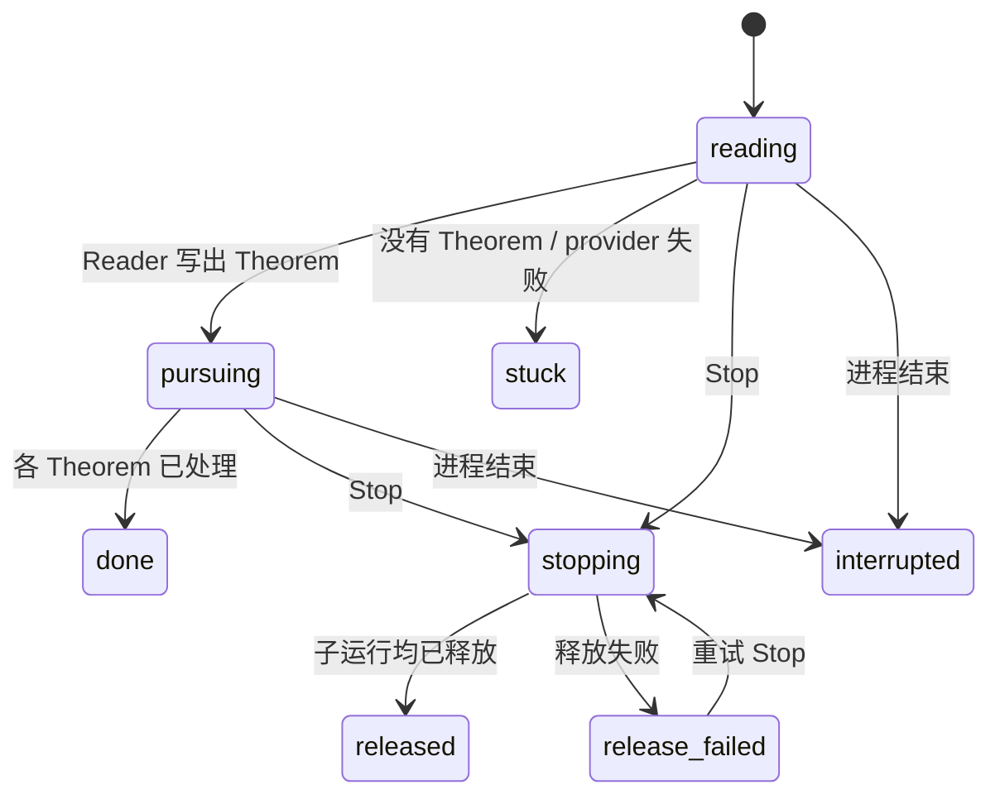

# ADR-0021 设计优化与当前实现审计

日期：2026-10-08（Europe/Zurich）。状态：设计建议，尚未修改已接受的 ADR 或运行源码。

结论：保留“信任约束决定，进度允许条件证明”。当前集成版本仍有信任、停止和记录缺陷。不能将现有测试通过解释为 T8 已验收。

## 审计版本

检查的是以下固定快照。三个来源工作目录在取样时均无未提交差异。

| 包 | Head | 比较基线 | merge-base |
| --- | --- | --- | --- |
| proof-cli | `37c90f473fff13c47e1aa3d5286c9b27c1ebc9c7` | `c259da02f2ddb7c255aecf0db3d5ec2af40bb357` | `6c26073d161210af4baedd7dd34737b94efa780f` |
| proof-agents | `02ed7549148ea43a67af98134b3b216b8a461d7d` | `ff073ccb0982430a266acfcf224ec1f68aa821ed` | 同基线 |
| proof-web | `0c1375a34a95ec5959578d905e4ae5a5cf0f3ed5` | `2f6df88617f41c5f5b69dff3e9a16f968db604ca` | 同基线 |

原始来源、提交列表、完整 diff 和测试日志保存在 [审计目录](/Volumes/Codex-Workspace/live/home/zhdeng/proof-cli/docs/audits/2026-10-08-adr0021-evidence/manifest.json)。
需求来源：[ADR 总 issue #193](https://github.com/DengZhiyuan-math/proof-cli/issues/193)、[T8 #197](https://github.com/DengZhiyuan-math/proof-cli/issues/197)、core #194–196、agents #12–14、web #8，以及本次用户给出的取舍。

这些快照不是当前 master 的完整集成结果。core 与 `c259da0` 分别有 24 / 7 个独有提交。agents 没有已合并的 `dc802c0`（Definitions 支持）。web 也没有 Definitions PR #6 的实现。最终测试必须在补齐依赖后的新 Head 上重跑。

## Standards

两个独立审计轴保留各自结论，不用实现正确性抵消记录规范问题。

- **[P1] Standing question 写入失败被静默丢弃。** [agent_run.py:863](/private/tmp/proof-0021-audit-kpquveoz/agents/src/proof_agents/agent_run.py:863) 捕获所有记录异常并正常返回。调用方随后清除 `asked` 并继续。注入 `OSError` 后，没有 question、备用 closing note 或可见错误。违反 ADR-0021 C8 的“记录选择”要求，以及 AGENTS 的可审计、Local-state-first 约束。记录失败必须可见；未落盘前不能视为问题已记录。探针：[probe_question_record_failure.py](/Volumes/Codex-Workspace/live/home/zhdeng/proof-cli/docs/audits/2026-10-08-adr0021-evidence/probe_question_record_failure.py)。
- **[P2] 项目 Pursue 的历史没有落盘。** [studios.py:545](/private/tmp/proof-0021-audit-kpquveoz/web/src/proof_web/studios.py:545) 使用 `record=lambda note: None`。Reader 未写出 Theorem 后的 `stuck` 状态，在新建 StudioHub 后变成 `idle`。违反 Local-state-first。这证实了已知设计缺口。复用已有 SQLite events 即可。

没有发现额外可操作的代码异味。实现复用了 hooks 和标准库 threading。依赖方向符合 ADR-0018，没有增加依赖。

Standards：2 项，最高 P1，为必需记录的静默丢失。

## Spec

- **[P1] 真正的人工阻塞被转换为 Standing question。** ADR-0021 C8 保留陈述矛盾和人工专属事实的 `needs-human`。但 [agent_run.py:561](/private/tmp/proof-0021-audit-kpquveoz/agents/src/proof_agents/agent_run.py:561) 在 Pursue 的同一 turn 有 split 时无条件转换。探针明确报告 `x > 0` 与 `x <= 0` 的矛盾，实际返回 `done`，并把拆分交给 Coordinator。应删除这个兜底转换；Pursue brief 已移除旧的“结构等待确认”门槛。显式 `needs-human` 必须保留。
- **[P2] 总预算边界跳过 Parked。** ADR-0021 C9 要求预算用尽的节点进入 Parked。[coordinator.py:289](/private/tmp/proof-0021-audit-kpquveoz/agents/src/proof_agents/coordinator.py:289) 在 `_park()` 前退出。父节点拆分花 1 turn、子 Claim 花 1 turn 后，实际 `parked=[]`，没有 Parked 日志，Claim 仍被占用。应先记录已结束且预算耗尽的节点，再结束调度。不要把仍在运行的节点误标 Parked。
- **[P2] Reference review 未呈现“未核对原文”警告。** ADR-0021 A3 要求研究者在 Reference review 看见该警告。[server.py:684](/private/tmp/proof-0021-audit-kpquveoz/web/src/proof_web/server.py:684) 的审阅卡只有 statement 和 citation。警告留在依赖该文献的 Lemma 的 verdict / Evidence check，导入节点详情和 review queue 都没有它。应显示相应依赖快照的来源检查结果，并标明 node、snapshot 和是否过期。

Spec：3 项，最高 P1，为真实人工阻塞被消除。

探针和输出：[test_spec_probes.py](/Volumes/Codex-Workspace/live/home/zhdeng/proof-cli/docs/audits/2026-10-08-adr0021-evidence/test_spec_probes.py)、[spec-probe-output.txt](/Volumes/Codex-Workspace/live/home/zhdeng/proof-cli/docs/audits/2026-10-08-adr0021-evidence/spec-probe-output.txt)。

## 独立跨包探针

| 发现 | 实际行为 | 修复方向 |
| --- | --- | --- |
| **P1：Reader 的信任防护不完整** | 不写 identifier/source-type，默认 `other` 仍匹配合法 Trust rule；复用研究者已有 DOI citation 也直接得到 `trusted-by-rule` | 在 core 的信任推导中约束 agent 创建的 Imported result，而不是约束命令字符串 |
| **P2：项目级释放失败被隐藏** | `ProjectPursuit.stop()` 忽略 `Coordinator.release()` 的 `RELEASE_FAILED`，报告 `released`；预算结束后的释放失败也被忽略，随后启动第二个 Theorem | 传递并保留 release-failed；保留 current 和 run identity，允许重试；释放成功前不启动下一 Theorem |
| **P2：集成缺少 Definitions 支持** | Reader 能写 Definition；普通 Verifier 的 Claude permissions 不允许 `definition list/show`；BriefingParts 也不携带定义 | 先合入 agents 已接受的 Definitions 支持，再合入 web 的相应支持；重跑跨包回归 |
| 已知持久化缺口 | `stuck: the Reader stated no Theorem` 在新 hub 中变为 idle | 将项目结束原因保存到已有 events |

两个 Reader 路径都已复现 `trusted-by-rule`。这是“Reader 结果必须逐条审阅”与当前 Trust rule 语义之间的缺口。不是恶意绕过脚本；使用的是 Reader 被允许的 node-create 参数。

**复核更正（2026-10-08）：** 这两条路径都符合 ADR-0014 的原文，并非实现漏洞。规则只读引用条目的字段，第 3 点明确允许信任 `other` 的规则。问题在设计层面：规则担保来源，不担保 agent 写的陈述，而且绕过了 ADR-0021 第 3、10 点的审阅环节。研究者已决定按 ADR-0022 修订：Trust rule 只覆盖研究者创建的 Imported result。

测试：[test_audit_probes.py](/Volumes/Codex-Workspace/live/home/zhdeng/proof-cli/docs/audits/2026-10-08-adr0021-evidence/test_audit_probes.py)。输出：[probes.log](/Volumes/Codex-Workspace/live/home/zhdeng/proof-cli/docs/audits/2026-10-08-adr0021-evidence/probes.log)。其中 6 个断言失败覆盖上述行为；两个释放断言对应同一个生命周期缺陷。

原有 core 套件另发现错误码注册失败：`NO_PURSUIT`、`PURSUIT_ACTIVE`、`READER_FAILED` 未注册到 `ERROR_CODES`。这是跨包 CLI 合同缺陷，最终集成时必须修复。见 [core-tests.log](/Volumes/Codex-Workspace/live/home/zhdeng/proof-cli/docs/audits/2026-10-08-adr0021-evidence/core-tests.log)。

## 四项现有取舍

| 取舍 | 优化后的决定 |
| --- | --- |
| Standing question 回答只记录 human | 保留 core 的 `by="human"` 权限语义。新增可选 `answered_by`，由页面取得 git identity，作为审计显示信息。它不授予权限、不改变 trust，也不改写历史回答 |
| Unverifiable Claim 像 Accepted 一样受保护 | 保留历史保护。明确区分“历史冻结”与“当前可调用”。Unverifiable 不能获得 Accepted 的可调用性，也不能获得 Decomposer 的免占用摘边例外。正常研究者结构编辑仍按已有规则处理 |
| Reader 禁写 identifier/source-type，且误拒绝包含 `claim "` 的文本 | 将信任防护移到 core 后，Reader 可以保存完整书目信息。Imported result 是否需要审阅由其自身来源决定。Claim 创建限制仍保留为角色约束；不再用书目参数的禁用来表达信任规则 |
| work log 只列本节点重述和所引用 Definition 的编辑 | 保留局部日志。另提供派生的 `stale_causes`：变更对象、event id、依赖路径、旧快照。页面显示“因 C2 重述而过期”，链接到源事件；不复制下游事件到父节点日志 |

`answered_by` 只是补足“谁操作过页面”。当前系统仍采用 ADR-0010 的合作式 agent 边界，git identity 不是经过认证的人类身份。

Reader 的 Claim 限制也应使用已解析的参数。ReaderContext 传递明确的 reader role；CLI 在解析后拒绝 `kind=claim`、`--parent` 和 `--reassign`。这样不必搜索原始命令里的 `claim "`，合法陈述也不会因正文引用该片段被误拒绝。这仍是 ADR-0010 的合作式角色约束，不把环境变量当作人类身份认证。

## 1. 项目 Pursue：复用 events，不引入通用日志系统

core 已有 `append_event(..., entity_id=None, payload=...)`。数据库可以保存不属于节点的事件。缺少的是服务接口和页面接线，不是存储能力。

新增一个项目级 `pursuit` 事件族，带 `pursuit_id`、阶段、结果、原因、provider、关联 Theorem 和预算消耗。开始、Reader 结束、Theorem 切换、停止、释放失败和最终结束必须落盘。每条记录只追加。

CLI 提供 `proof project progress` 读取它；需要写入时使用同一服务函数。web 调用该函数，替换 no-op hook。不要借一个假的 node 保存 Reader 失败。

恢复契约：重启后保留历史，不宣称旧进程仍在工作。未结束的 pursuit 显示 `interrupted`。协调器重查现存 claim、snapshot 和节点状态后，再由新的 Start 继续。v1 不恢复 agent 子进程、不自动花费新的 provider 预算。

记录失败是可见错误。Start 记录失败时不启动 provider。后续记录失败时保留失败状态和未完成记录，不用 `except: pass` 假装成功。

## 2. Reference edit：区分书目修正与数学接口

新增最小的 `proof reference edit <id> ... --reason ...`，复用 `ReferenceRecord`、`store_reference` 和 events。保持 reference id、created_by、created_at 不变。记录修改人、原因、旧值和新值。提供部分更新，未给出的字段保持原值。

title、authors、year、URL、notes 和 typed metadata 可以修正。Imported result 的 statement、source_locator、source_version 和 reference_id 仍按其数学接口规则处理。引用另一份作品或另一版定理时，创建新 Imported result，再明确迁移依赖。不要用书目编辑冒充数学接口更换。

**必要的信任修订（已由 ADR-0022 决定）：** agent 创建的 Imported result，在自身有效 Reference review 之前保持 unreviewed；Trust rule 不为它直接授予 callable。该约束检查 node 的作者，不检查 ReferenceRecord 的作者。因此复用 human citation、补齐 DOI 和 source_already_reviewed 都不能绕过它。有效显式 review 仍优先；no-longer-callable 仍终止可调用性。

该修订已写入 ADR-0022，同时修订 ADR-0014 与 ADR-0021 的序言。实现时仍须测试研究者原有 Imported result 的规则行为不变，并统计现有项目中受影响的 agent 导入。

Reader 的常规书目信息由此可以完整写入。补元数据不再需要重复导入，也不应要求换一个 reference id。

## 3. 预算：证明额度与结构额度分开，总消耗统一限制

保留 node 的证明预算，用于 Prover、Verifier、Typesetter 和 Numerics。Reader 和 Decomposer 使用结构额度。每个父节点至多一次初次拆分和一次因 Parked Claim 触发的重拆分。两个结构 turn 不扣父节点的证明 turn。

所有真实 turn 仍计入 Pursue 总预算和同一个耗时上限。Start 保存预算值；重试、重拆分、新 Claim 都不能提高已授权的总上限。提供一个明确的 Pursue 总额度，页面在 Start 前显示；默认值可从 Start 时已有节点和当前 node budget 计算，不能随着 split 无限增长。

调度顺序：先收集结束 turn 的消耗；再记录已结束且额度耗尽的节点；最后判断全局预算和可启动任务。全局预算结束时，不启动新 turn，运行中的 turn 按既有截止机制停止，然后明确记录 Parked 或 Interrupted 结果。不能让“总预算结束”跳过队列记录。

父节点仍可能因全局预算不足无法证明。这是显式的总预算结果，不再是拆分偷偷耗尽其自身证明额度。

启动失败计入有界 retry 次数，不伪装成实际 provider turn。预算日志同时显示实际 turn 和失败启动次数。

## 4. T8：在新集成 Head 上做两级验收

先处理上述信任、人工阻塞、记录和释放缺陷，并补齐 Definitions。随后按 core → agents → web 的顺序固定新的集成 Head。所有测试和试验记录写入相同 manifest。

第一阶段使用受控 provider 做浏览器流程验收：Pursue、Stop 与重试、刷新、服务器重启、Reader 无 Theorem、释放失败、小预算 Parked、Standing question 回答、Definition 修改后的过期原因。它验证 UI 和状态机，不验证数学能力。

第二阶段执行 #197 的真实 trial。新项目只放入 `library-horo/main.tex`，保留输入 SHA-256 和 `setup-tier3-horo.sh` 的比较版本。使用项目配置中的真实 provider，先记录总 turn、耗时上限和模型标识；之后按试验要求不输入研究者指令。

记录：Reader 的 map 与手工 map 的差别、departures、Provisional/Conditional、Standing questions、Parked 和停止原因。浏览器检查 queue 的顺序和内容，以及刷新后的保留情况。重启试验应作为独立场景，不混入“无研究者输入跑到多远”的原始 trial。

通过条件不是“证明了主定理”。是路径可执行、结论标记真实、未核对原文明确可见、人工决定仍被保留、每个停止结果可恢复。数学正确性和最终 Acceptance 由研究者另行判断。

本次没有运行真实 provider 或浏览器 T8。当前发现的缺陷使该验收仍是未完成项。

## 验证记录

解释器：`/opt/anaconda3/bin/python`。所有包的导入路径已核对指向固定审计快照。测试项目使用临时目录。

| 验证 | 结果 |
| --- | --- |
| agents 原有套件 | 152 passed |
| web 原有套件 | 736 passed, 1 skipped |
| core / latex-agent 套件 | 1106 passed, 16 skipped, 1 failed（错误码注册） |
| 独立信任、释放、Definitions、重启探针 | 6 failed，均为预期缺陷断言 |
| 独立 Spec 探针 | 3 failed，均已定位到实现 |
| Standing question 记录失败注入 | 复现异常被吞掉且无备用记录 |
| 真实 provider / 浏览器 T8 | 未执行 |

建议修复顺序：信任资格 → 保留真实 needs-human → 记录失败与释放失败 → 补齐跨包 Definitions → 项目事件与 reference edit → 预算计数与 Parked → 新 Head 全套测试 → T8。
